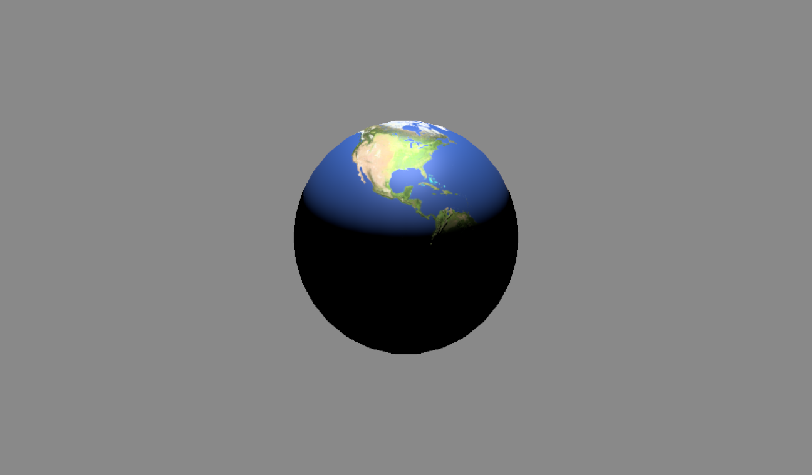
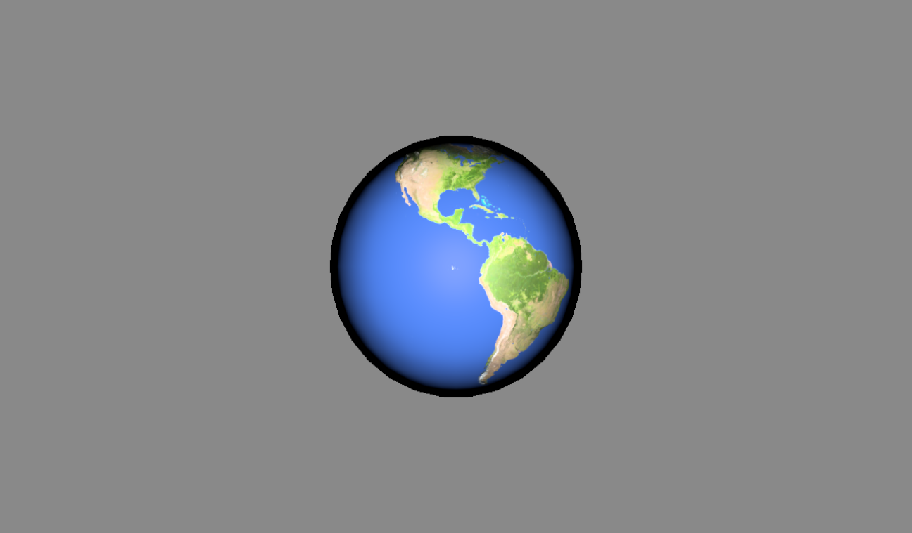
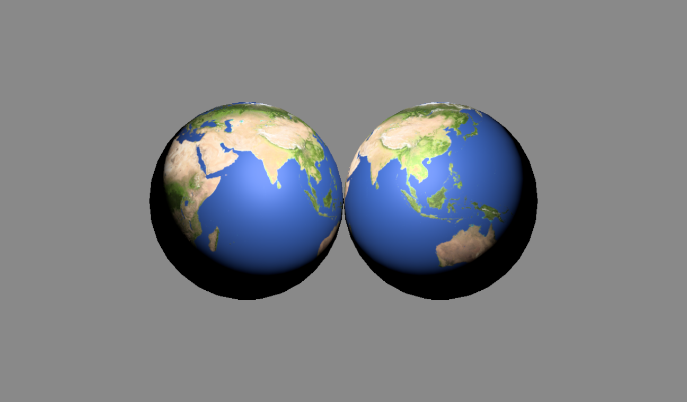

# Direct3D12を用いた自作描画プログラム（製作途中）

Win32 + Direct3D 12 で開発している個人制作のレンダリング／ゲーム基盤プロジェクトです．

App / Engine / Game の3層構成で，D3D12の初期化，ディスクリプタ管理，GLBモデル読み込み，
PBRマテリアル，入力処理，カメラ制御などを自作しています．

このプロジェクトは現在製作途中で，将来的にはゲームに発展させることを目標としています．

## スクリーンショット

以下の画像は，ポイントライトとスポットライトの2種で読み込んだモデルを描画しています．
法線マップを適用したPBRマテリアルに対して，トーンマッピングまで含めた描画結果を示しています．




## 実装機能

### レンダリング

- D3D12 device, swap chain, command queue, command list, fence の初期化
- RTV / DSV / CBV-SRV-UAV / Sampler のディスクリプタヒープ管理
- ダブルバッファリングによるフレーム管理
- PSO / Root Signature の構築と切り替え

### 3Dモデル読み込み

- Assimp による GLB/glTF モデル読み込み
- DirectXTex によるテクスチャ読み込み
- BaseColor / Metallic-Roughness / Normal に対応したマテリアル管理
- デフォルトテクスチャの生成と不足テクスチャの補完
- 複数モデルのロードと描画

### シェーダー

- Lambert / Cook-Torrance / GGX ベースのシェーダーを試作
- 法線マップ用の TBN 構築
- トーンマッピングの適用

### 入力処理・オブジェクト制御

- キーボード・マウス入力の状態管理
- カメラの位置・回転制御
- 描画対象となるオブジェクトの制御

## 技術的工夫

### 1. App / Engine / Game の分離

Win32 のウィンドウ生成やメッセージループはAppに分離し，
D3D12 の初期化や描画処理はEngineに集約しています．
Game にはカメラ操作や，今後実装予定のゲームロジックを配置し，責務を分離しています．

### 2. ディスクリプタ管理

ディスクリプタヒープの管理を行うDescriptorPoolクラスを作成しました．
単一ディスクリプタだけでなく，マテリアル用に連続領域を確保する機能も実装しています．

### 3. マテリアルとテクスチャの管理

GLBファイルから読み込んだテクスチャとPBRパラメータをMaterialGPUクラスでGPU側リソースに変換しています．
テクスチャが不足している場合は，デフォルトの白色テクスチャとパラメータを使い，シェーダー側の分岐を減らしています．

## 操作方法

- WASDでカメラ移動
- QEで左右にカメラ回転

デバッグ用の暫定的なもののため，オブジェクト座標ではなくワールド座標で移動・回転する仕様となっています．

## プロジェクト構成

```text
DirectXGame/
├── App/        #プロジェクトファイル
├── Engine/     #プロジェクトファイル
├── Game/       #プロジェクトファイル
├── include/
│   ├── App/      # Window, Application などOS依存の宣言
│   ├── Engine/   # D3D12初期化、描画、アセット管理、入力、カメラ
│   └── Game/     # ゲーム側ロジック、カメラコントローラ
├── src/
│   ├── App/
│   ├── Engine/
│   └── Game/
└── assets/       # モデルやシェーダー
```

## 今後の実装予定

このプロジェクトは現在製作途中で，将来的にはゲームに発展させることを目標としています．

- 複数ライトの描画
- IBLの導入
- AABBによる衝突判定

## 依存ライブラリ

| ライブラリ                                              | 用途                      |
| ------------------------------------------------------- | ------------------------- |
| [DirectXTK12](https://github.com/microsoft/DirectXTK12) | DirectX 12 ユーティリティ |
| [DirectXTex](https://github.com/microsoft/DirectXTex)   | テクスチャ読み込み・処理  |
| [Assimp](https://github.com/assimp/assimp)              | 3D モデルインポート       |

## 開発環境

- Windows 11
- Visual Studio 2022
- vcpkg

## ライセンス

本プロジェクトは [MIT License](LICENSE) の下で公開されています。

## Third-Party Licenses

本プロジェクトは以下のオープンソースライブラリを使用しています：

- [DirectXTK12](https://github.com/microsoft/DirectXTK12) - MIT License
- [DirectXTex](https://github.com/microsoft/DirectXTex) - MIT License
- [Assimp](https://github.com/assimp/assimp) - BSD 3-Clause License

各ライブラリのライセンス全文は、それぞれのリポジトリをご確認ください。

##
